# Architecture & Flow Diagrams

This document contains visual diagrams of the system architecture and agent flows.

---

## 1. Core Perception-Decision-Action Loop

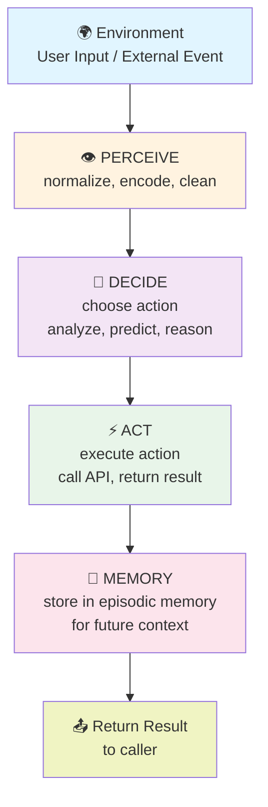

---

## 2. Agent Type Comparison

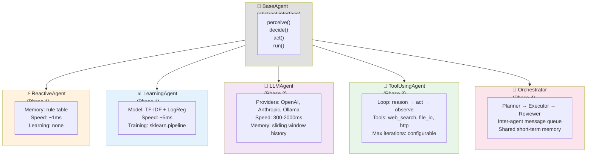

---

## 3. ReactiveAgent Flow

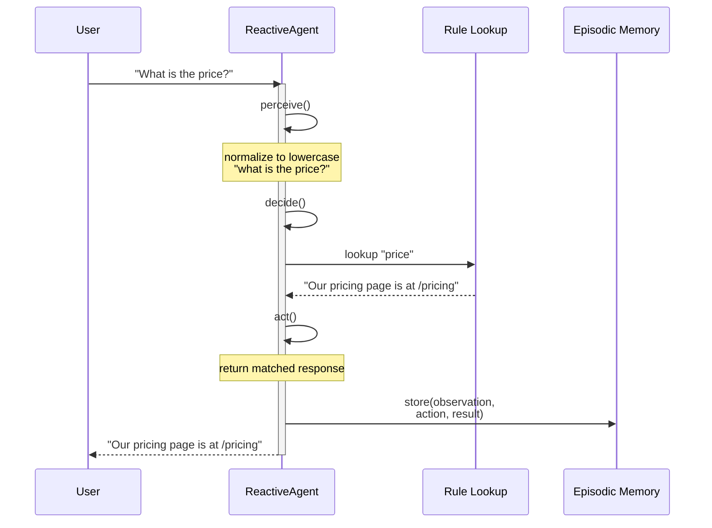

---

## 4. LearningAgent Flow

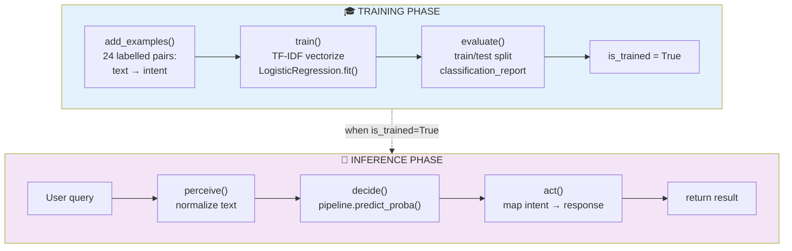

---

## 5. LLMAgent Flow

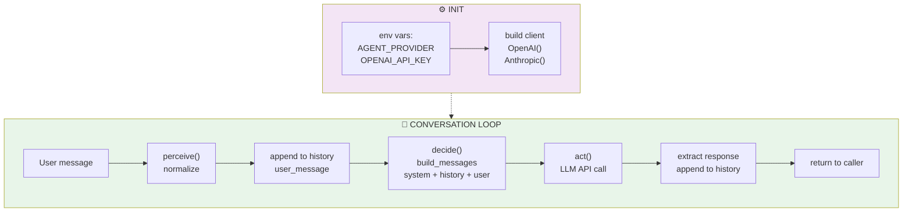

---

## 6. ToolUsingAgent Flow (Phase 3)

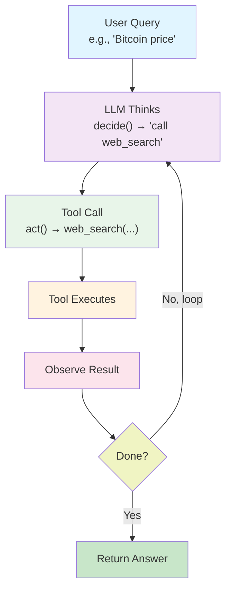

---

## 7. Multi-Agent Orchestration (Phase 4)

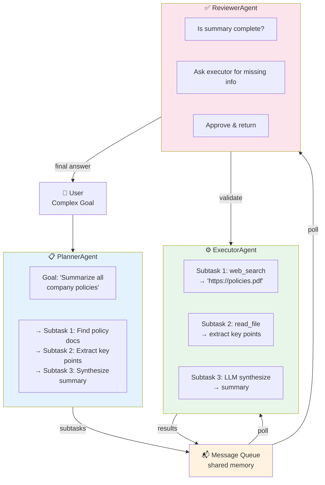

---

## 8. System Architecture (Full Stack)

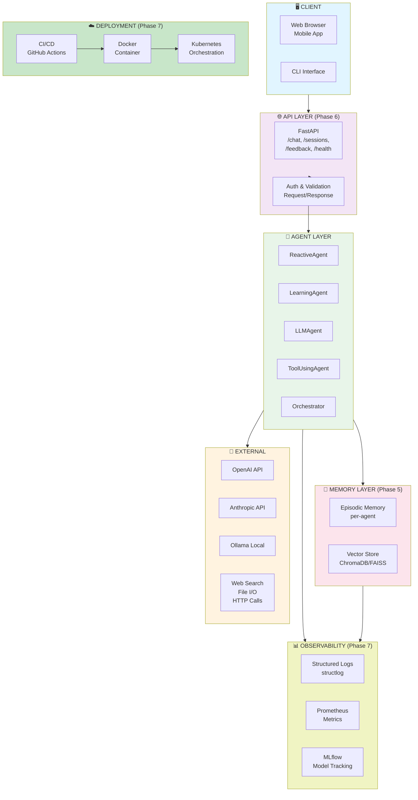

---

## 9. Data Flow: End-to-End Chat

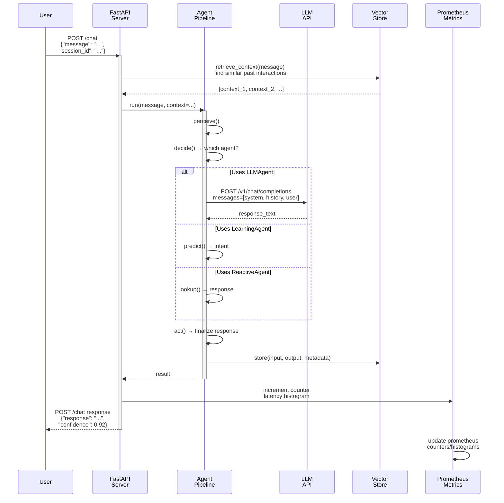

---

## 10. Decision Tree: Which Agent to Use?

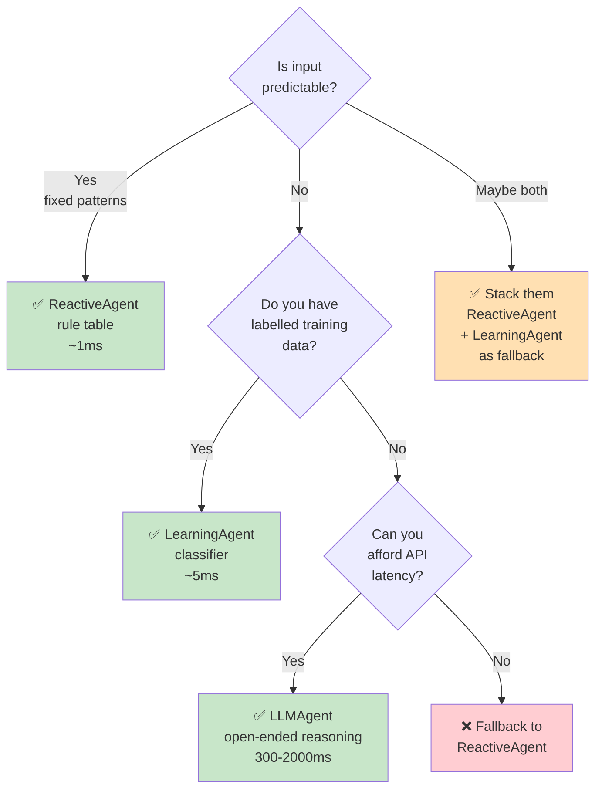

---

## 11. Technology Stack by Phase

```mermaid
graph LR
    subgraph Phase1["Phase 1"]
        P1a["Python 3.12"]
        P1b["numpy, pandas"]
        P1c["scikit-learn"]
    end
    
    subgraph Phase2["Phase 2"]
        P2a["python-dotenv"]
        P2b["openai,<br/>anthropic"]
    end
    
    subgraph Phase3["Phase 3"]
        P3a["duckduckgo-search"]
        P3b["requests"]
    end
    
    subgraph Phase4["Phase 4"]
        P4a["chromadb"]
        P4b["sentence-transformers"]
    end
    
    subgraph Phase5["Phase 5"]
        P5a["chromadb /FAISS"]
    end
    
    subgraph Phase6["Phase 6"]
        P6a["fastapi"]
        P6b["uvicorn"]
        P6c["pydantic"]
    end
    
    subgraph Phase7["Phase 7"]
        P7a["structlog"]
        P7b["prometheus-client"]
        P7c["mlflow"]
        P7d["Docker"]
        P7e["Kubernetes"]
    end
    
    Phase1 --> Phase2 --> Phase3 --> Phase4 --> Phase5 --> Phase6 --> Phase7
    
    style Phase1 fill:#c8e6c9
    style Phase2 fill:#bbdefb
    style Phase3 fill:#ffe0b2
    style Phase4 fill:#f8bbd0
    style Phase5 fill:#e1bee7
    style Phase6 fill:#b2dfdb
    style Phase7 fill:#fff9c4
```

